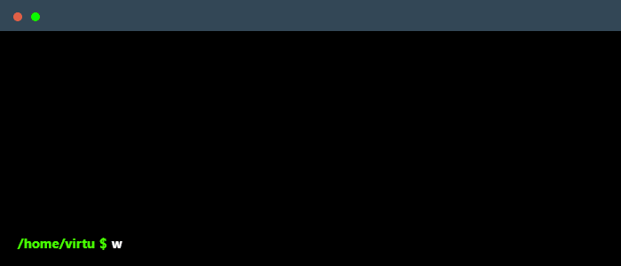

  

 

  

  

    
    
    
    
  

  
<b>Python Developer → DevOps Engineer | Building reliable backend systems & automation</b>

   

  

 

---

## 🛠 Tech Stack

<table border="0" width="100%">
  <tr>
    <td width="50%" valign="top">

### Core & Backend

### Databases & Data

### Frontend

    </td>
    <td width="50%" valign="top">

### DevOps & Infrastructure

### Tools & Ecosystem

### ML & Web Scraping

    </td>
  </tr>
</table>

 

  <picture>
    <source media="(prefers-color-scheme: dark)" srcset="https://raw.githubusercontent.com/maksim-sharshov/maksim-sharshov/output/github-snake-dark.svg" />
    <source media="(prefers-color-scheme: light)" srcset="https://raw.githubusercontent.com/maksim-sharshov/maksim-sharshov/output/github-snake.svg" />
    
  </picture>

